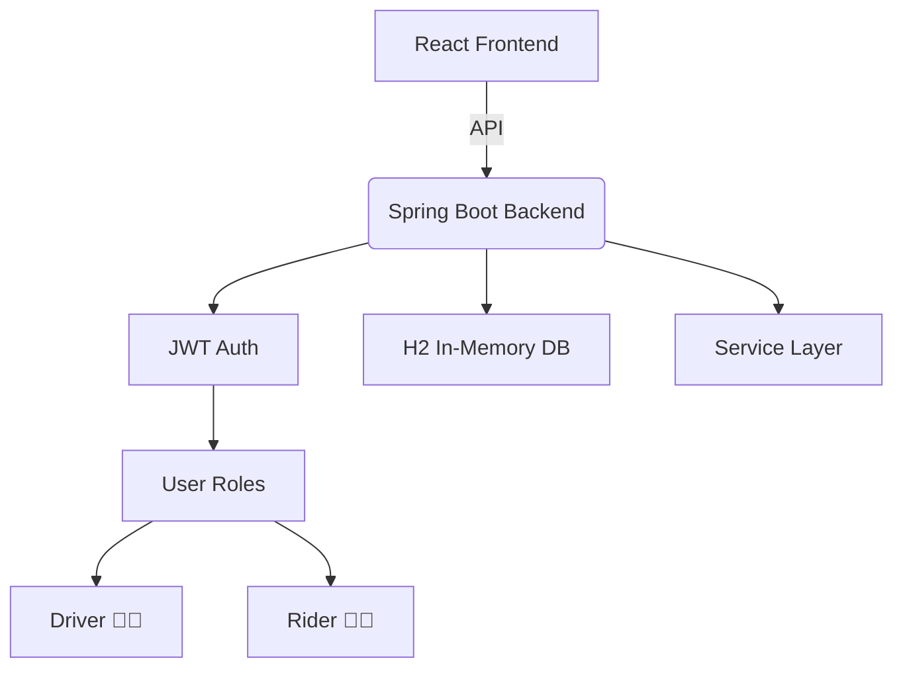

<!-- Hero Section -->

<h1 align="center">
  🚕 RideShare
</h1>
<p align="center">
  <b>Empowering Smart Mobility in Semi-Urban Cities</b>  
</p>
<p align="center">
  
  
  
  
  
</p>

---

## 🧭 TL;DR

> **RideShare** is a full-stack ride-sharing platform focused on **semi-urban transportation gaps**. It uses a **React + Tailwind frontend**, a **Spring Boot backend** — perfect for development, demos, and quick prototyping.

---

## 🧱 Architecture Blueprint



---

## ✨ Key Highlights

| 🔧 Core           | 🌟 Features                           |
| ----------------- | ------------------------------------- |
| Role-Based Access | Driver & Rider dashboards             |
| JWT Auth          | Secure and stateless                  |
| In-Memory DB      | No setup, instant demo-ready          |
| Clean Codebase    | Modular Spring Boot structure         |
| Tailwind UI       | Minimalist and responsive             |
| Dev Ready         | Quick boot for hackathons, POCs, MVPs |

---

## ⚙️ Setup in 3 Minutes

### 🔹 1. Clone the Repo

```bash
git clone https://github.com/your-username/rideshare.git && cd rideshare
```

### 🔹 2. Start Backend (Spring Boot + H2)

```bash
cd backend
./mvnw spring-boot:run
```

> H2 Console: `http://localhost:8080/h2-console`
> JDBC URL: `jdbc:h2:mem:testdb`

### 🔹 3. Start Frontend (React + Vite)

```bash
cd frontend
npm install
npm run dev
```

---

## 📆 Project Structure

```txt
📆 rideshare
🔾 frontend/
│   ├── components/
│   ├── pages/
│   └── services/
🔾 backend/
    └── com.rideshare/
        ├── controller/
        ├── service/
        ├── model/
        └── repository/
```

---

## 🤠 Sample Flow

```txt
User (Driver/Rider)
    ↓
  Login (JWT)
    ↓
Choose Role → View Dashboard
    ↓
Request or Accept Ride
    ↓
Update H2 DB (Auto flush)
```

---

## 🚣️ Roadmap

* [x] Login/Signup with Role Routing
* [x] Driver & Rider dashboards
* [x] Live Ride Tracking
* [ ] Chat System
* [ ] Geo-based Filtering
* [ ] PWA Version for Rural Access

---

## 🖼️ Screens (Coming Soon)

```md


```

---

## 🧹 Tech Summary

| Layer    | Tool             |
| -------- | ---------------- |
| Frontend | React + Tailwind |
| Backend  | Spring Boot      |
| Auth     | JWT              |
| Database | H2 (In-Memory)   |

---

> Built for **speed, clarity, and real-world problem-solving** — RideShare is your starting point for mobility platforms in emerging towns.

---
